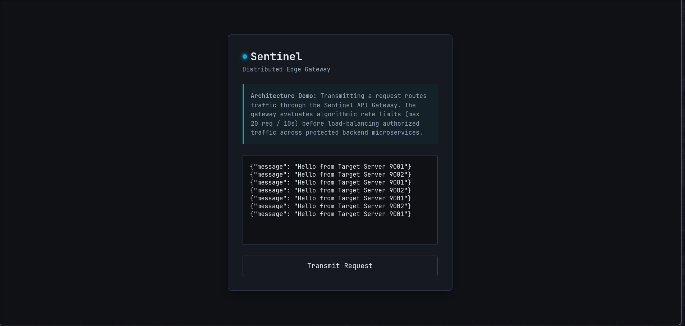
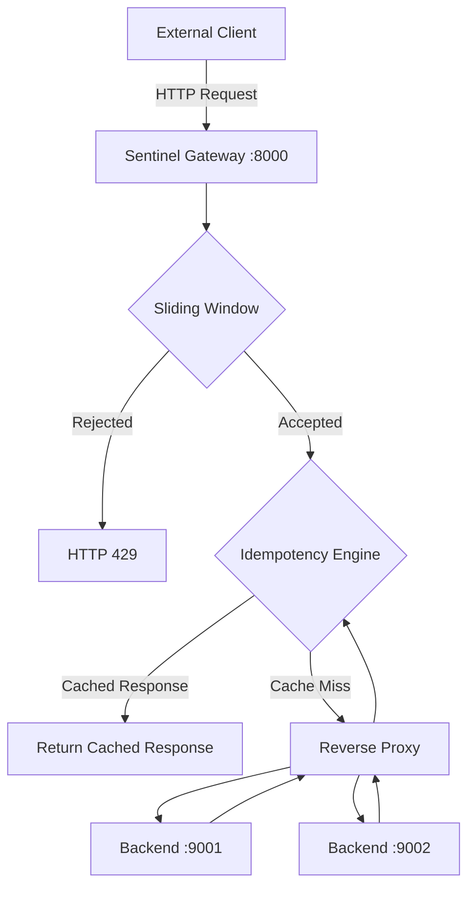

# 🛡️ Sentinel

## Concurrent Reverse Proxy & API Gateway in Go

<div align="center">


[](https://github.com/AnandRaj2224/sentinel/actions/workflows/ci.yml)
[](https://github.com/AnandRaj2224/sentinel/actions/workflows/cd.yml)
</div>

Sentinel is a concurrent reverse proxy and API gateway written in **Go**. It centralizes edge concerns—including **rate limiting**, **idempotency**, **reverse proxying**, and **structured logging**—allowing backend services to remain stateless and focused solely on business logic.

Built around Go's concurrency primitives, Sentinel leverages **lock striping**, **double-check locking**, and lightweight middleware to efficiently process concurrent HTTP traffic while enforcing security and reliability at the network edge.

---

# 🖼️ Dashboard

Sentinel includes a lightweight server-rendered management dashboard built with **HTMX** for exercising gateway functionality without external API clients.

The dashboard supports:

- Interactive request testing
- Custom request headers
- `Idempotency-Key` testing
- Rate-limit verification
- Live gateway responses
- Server-driven UI powered entirely by HTMX



---

# ✨ Features

- Sliding Window Log rate limiter
- Idempotency engine for safe request retries
- Layer-7 reverse proxy (`httputil.ReverseProxy`)
- Round-robin backend selection
- Lock striping to minimize synchronization contention
- Double-check locking for concurrent state initialization
- Structured JSON logging using `log/slog`
- HTMX management dashboard
- Azure deployment
- Multi-stage Docker builds with minimal `scratch` runtime images

---

# 🚦 Request Lifecycle

```text
Client
   │
   ▼
┌────────────────────┐
│ Logging Middleware │
└────────────────────┘
          │
          ▼
┌────────────────────┐
│ Sliding Window RL  │
└────────────────────┘
          │
          ├── Rate Limit Exceeded
          │
          ▼
      HTTP 429
          │
          ▼
┌────────────────────┐
│ Idempotency Engine │
└────────────────────┘
          │
     Cache Hit?
      │       │
     Yes      No
      │        │
      ▼        ▼
Return Cached  Reverse Proxy
 Response         │
                  ▼
        Round-Robin Backend
                  │
                  ▼
          Cache Response
                  │
                  ▼
          Return Client
```

---

# 🏛️ Architecture

Sentinel acts as the single public entry point for the application. Backend services are isolated inside a private Docker network and expose no public ports. Every request passes through the gateway before reaching an application service.



---

# 🚀 Concurrency & Design

## Lock Striping

Instead of protecting gateway state with a single global mutex, Sentinel partitions synchronization into independent resource-specific locks. Requests targeting unrelated routes or clients execute concurrently with minimal contention.

### Double-Check Locking

Concurrent state initialization follows a double-check locking strategy. Resources are first checked under a shared read lock and only upgraded to an exclusive write lock when allocation is required.

### Idempotent Request Processing

Requests containing an `Idempotency-Key` are intercepted before reaching backend services. Successful responses—including status code, headers, and payload—are cached and replayed for duplicate requests, preventing repeated execution of state-changing operations.

### Structured Logging

Every request passes through middleware built on Go's `log/slog`, producing structured JSON logs suitable for centralized observability platforms.

---

# 📊 Performance

Stress-tested using **hey**.

### Configuration

- 10,000 Requests
- 100 Concurrent Workers
- Single Rate-Limited Endpoint


| Metric          |        Result |
| --------------- | ------------: |
| Throughput      | 9,889 req/sec |
| Average Latency |        9.6 ms |
| p50             |        6.7 ms |
| p95             |       28.9 ms |
| p99             |       45.8 ms |

### Correctness

```text
HTTP 200 : 20
HTTP 429 : 9980
```

The configured limit allowed **20 requests** within the active window. Under concurrent load, Sentinel forwarded exactly **20** requests while rejecting the remaining **9,980** with HTTP **429**, demonstrating correct rate-limit enforcement.

---

# 📖 Design Decisions

### Why Sliding Window Log?

Sliding Window Log provides more accurate request accounting than fixed-window algorithms and avoids burst amplification near window boundaries.

### Why Lock Striping?

A global mutex becomes a bottleneck under concurrent workloads. Lock striping localizes synchronization to individual resources, improving scalability.

### Why In-Memory Idempotency?

An in-memory cache minimizes latency by eliminating additional network hops. A Redis-backed implementation is planned for distributed deployments.

---

---

# ⚙️ Technology Stack

| Layer         | Technology                               |
| ------------- | ---------------------------------------- |
| Language      | Go                                       |
| Networking    | `net/http`                               |
| Reverse Proxy | `net/http/httputil`                      |
| Frontend      | HTMX + HTML + CSS                        |
| Concurrency   | Goroutines, `sync.Mutex`, `sync.RWMutex` |
| Logging       | `log/slog`                               |
| Containers    | Docker, Docker Compose                   |
| Cloud         | Microsoft Azure                          |

---

# 🚀 Getting Started

## Prerequisites

- Go 1.26+
- Docker
- Docker Compose

## Clone

```bash
git clone https://github.com/AnandRaj2224/sentinel

cd sentinel
```

## Run

```bash
docker compose up --build
```

This launches:

- Sentinel Gateway (`localhost:8000`)
- Protected backend services on an isolated Docker network

---

# 🔮 Roadmap

- [x] CI/CD pipeline
- [x] Azure VM deployment
- [ ] Redis-backed distributed rate limiting
- [ ] Redis-backed idempotency storage
- [ ] Prometheus metrics
- [ ] Grafana Dashboard
- [ ] Dynamic configuration reload
- [ ] Circuit breaker middleware

---

## 👨‍💻 Author

**Anand Raj**

Backend • Go • Distributed Systems • Infrastructure
